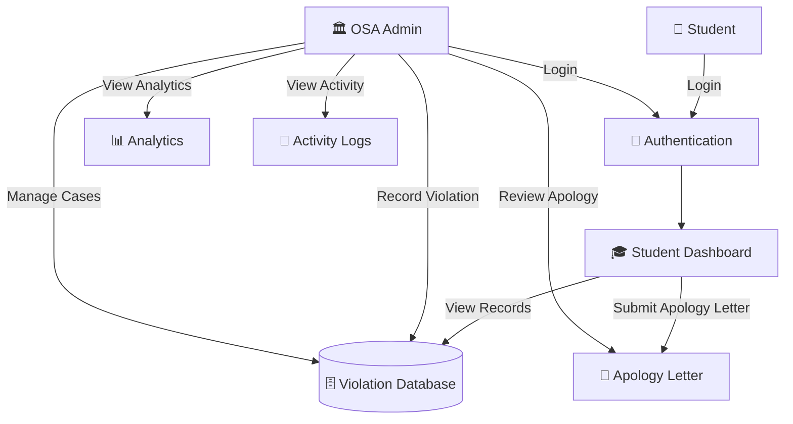
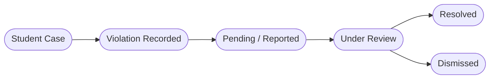

# 🛡️ UDM Office of Student Affairs Management System

> A Django-based web application for managing student violations, disciplinary cases, apology letters, and Office of Student Affairs (OSA) workflows for **Universidad de Manila (UDM)**.


---

## 📋 Table of Contents

* [Overview](#-overview)
* [Objectives](#-objectives)
* [System Scope](#-system-scope)
* [Core Features](#-core-features)
* [User Roles](#-user-roles)
* [Violation Management](#-violation-management)
* [Apology Letter Workflow](#-apology-letter-workflow)
* [System Architecture](#-system-architecture)
* [Tech Stack](#-tech-stack)
* [Setup and Installation](#-setup-and-installation)
* [Usage](#-usage)
* [API Endpoints](#-api-endpoints)
* [Project Structure](#-project-structure)
* [Development Notes](#-development-notes)
* [Source and Attribution](#-source-and-attribution)
* [License](#-license)

---

## 🔍 Overview

The **UDM Office of Student Affairs Management System** is a Django web application designed to digitize the management of student violations and disciplinary records at **Universidad de Manila (UDM)**.

The system provides a centralized platform where the **Office of Student Affairs (OSA)** can record and manage student violations while students can securely access their own records and submit required apology letters.

The project was adapted from an existing student violation monitoring system and subsequently modified to fit the requirements, scope, workflow, and academic objectives of the current UDM implementation.

---

## 🎯 Objectives

The system aims to:

| Objective                               | Description                                                                        |
| --------------------------------------- | ---------------------------------------------------------------------------------- |
| 📁 **Centralize Records**               | Maintain student violation and disciplinary records in one digital system.         |
| 📝 **Digitize Violation Reporting**     | Allow OSA personnel to record violation cases directly in the system.              |
| 🔎 **Improve Case Monitoring**          | Provide organized case-management and status-tracking functionality.               |
| 👤 **Provide Student Access**           | Allow students to securely view their own violation information.                   |
| ✉️ **Manage Apology Letters**           | Allow students to submit apology letters associated with their disciplinary cases. |
| 🔐 **Improve Access Control**           | Restrict system functions according to the user's role.                            |
| 📊 **Support Monitoring and Analytics** | Provide case statistics and violation trends for administrative monitoring.        |
| 🧾 **Maintain Accountability**          | Record important system activities for administrative tracking.                    |

---

## 🎯 System Scope

The current system is intentionally focused on the following functions:

### Included

* Student authentication
* OSA authentication
* Student violation records
* Violation type management
* Minor and major violation classification
* Violation status management
* Student case management
* Student profile and violation history
* Apology letter submission
* OSA case monitoring
* OSA analytics
* Activity logging
* Login activity monitoring
* Evidence/document attachment support
* Face-detection API
* Welcome text-to-speech API
* PostgreSQL production support
* SQLite development support

### Not Included in the Current Scope

The current implementation does **not** use the previous multi-role workflow for:

* Staff
* Guard
* Formator
* OSA Coordinator as a separate user category
* Student registration
* Internal messaging/chat as a primary system feature

The project is designed around the simplified UDM workflow of **Student + OSA/Administrative management**.

---

## 👥 User Roles

The current usable system has two primary user types:

| User          | Main Responsibilities                                                                                                                        |
| ------------- | -------------------------------------------------------------------------------------------------------------------------------------------- |
| **Student**   | Log in using their Student ID and password, view personal violation records, manage their profile, and submit apology letters.               |
| **OSA Admin** | Record and manage violations, review student cases, update case statuses, monitor disciplinary records, and access administrative analytics. |

### Student Authentication

Students do not register through the system.

The system assumes that student credentials are already available through the institution's existing student information/portal process.

Students authenticate using:

* **8-digit Student ID**
* **Password**

If the credentials cannot be found or are invalid, the system denies access.

> **Access Denied** is displayed when the provided student credentials do not match an existing student account.

### Internal Compatibility

For compatibility with the inherited codebase, the administrative role continues to use the internal role value:

```text
OSA_COORDINATOR
```

This internal name is retained to avoid unnecessary changes to existing models, decorators, URLs, and view functions.

The user-facing system, however, treats this account as the **OSA Admin**.

---

## ⚖️ Violation Management

The OSA Admin can record student violations using an existing student record.

A violation report can contain information such as:

* Student ID
* Violation type
* Violation category
* Incident date
* Incident time
* Incident location
* Description
* Witness information
* Evidence/document attachment
* Severity or classification
* Violation status
* Reporting OSA user

### Violation Categories

The current test and development dataset includes violation types such as:

1. Academic Dishonesty
2. Bullying / Harassment
3. Disrespectful Conduct
4. Fighting / Physical Altercation
5. Threatening Behavior
6. Unauthorized Entry
7. Unauthorized Use of School Property
8. Property Damage
9. Theft / Unauthorized Taking
10. Fraud / Falsification of Documents
11. Smoking / Vaping
12. Alcohol-Related Violation
13. Prohibited Substance Violation
14. Improper Uniform / Dress Code
15. ID / Identification Violation
16. Disruptive Behavior
17. Unauthorized Recording / Photography
18. Online / Social Media Misconduct
19. Gambling
20. Other / General Violation

> Penalties are not presented as official UDM disciplinary penalties unless officially provided by the institution. Development records use neutral wording such as **"To be determined by OSA"** where an official penalty has not been supplied.

---

## 🔄 Violation Status

Cases can be monitored using their current status.

The system supports statuses including:

* Pending
* Reported
* Under Review
* Resolved
* Dismissed

The Case Management interface allows the OSA Admin to filter and monitor cases according to their status and classification.

---

## 📝 Apology Letter Workflow

Students can submit an apology letter through their student dashboard when an apology is required for a disciplinary case.

The workflow is designed around:

```text
Student
   │
   │ Submit Apology Letter
   ▼
OSA Admin
   │
   ├── Review
   │
   ├── Approve
   │
   └── Request Revision / Reject
```

The student's apology history can include the current review status and administrative remarks.

The purpose of this workflow is to provide a digital record of the student's submission and the OSA's review decision instead of relying entirely on paper-based processing.

---

## 📊 Administrative Monitoring and Analytics

The OSA Admin dashboard provides administrative information for monitoring student disciplinary cases.

Depending on the available data, the analytics section can display information such as:

* Total cases
* Pending cases
* Cases under review
* Resolved cases
* Overdue cases
* Violation classifications
* Violation trends over time
* Student and case information

Development/test data may be used to demonstrate the behavior of analytics and case-management features.

---

## 🏗️ System Architecture

### General System Flow



### Violation Management Flow



---

## 🛠️ Tech Stack

| Layer                    | Technology                    |
| ------------------------ | ----------------------------- |
| **Programming Language** | Python 3.11+                  |
| **Web Framework**        | Django 5.2.7                  |
| **Production Database**  | PostgreSQL 16                 |
| **Development Database** | SQLite                        |
| **Admin Interface**      | Django Admin / django-jazzmin |
| **Computer Vision**      | OpenCV                        |
| **Numerical Processing** | NumPy                         |
| **Text-to-Speech**       | gTTS                          |
| **Image Processing**     | Pillow                        |
| **Static Files**         | WhiteNoise                    |
| **Production Server**    | Gunicorn                      |
| **Version Control**      | Git / GitHub                  |

---

## 🚀 Setup and Installation

### Prerequisites

Install the following before running the project:

* Python 3.11 or newer
* Git
* pip
* PostgreSQL 16 for production use
* A code editor such as Visual Studio Code

SQLite can be used for local development without installing PostgreSQL.

### 1. Clone the Repository

```bash
git clone https://github.com/y0ckbee/office-of-student-affairs-management-system.git
cd office-of-student-affairs-management-system
```

### 2. Create the Virtual Environment

```powershell
python -m venv virtualenv
```

### 3. Activate the Virtual Environment

For Windows PowerShell:

```powershell
.\virtualenv\Scripts\Activate.ps1
```

For Windows Command Prompt:

```cmd
virtualenv\Scripts\activate
```

### 4. Install Dependencies

```bash
pip install -r requirements.txt
```

### 5. Use SQLite for Local Development

PowerShell:

```powershell
$env:USE_SQLITE = "True"
```

Command Prompt:

```cmd
set USE_SQLITE=True
```

### 6. Apply Migrations

```bash
python manage.py migrate
```

### 7. Create an Administrative Account

```bash
python manage.py createsuperuser
```

### 8. Run the Development Server

```bash
python manage.py runserver
```

Open:

```text
http://127.0.0.1:8000/
```

Django Admin:

```text
http://127.0.0.1:8000/admin/
```

---

## 📖 Usage

### Student

1. Open the Student login page.
2. Enter the 8-digit Student ID.
3. Enter the assigned password.
4. Access the Student Dashboard.
5. View personal violation records.
6. Submit an apology letter when required.
7. Monitor the status of submitted information.

### OSA Admin

1. Open the OSA login page.
2. Authenticate using the OSA account.
3. Access the administrative dashboard.
4. Record violations for existing students.
5. Manage student cases.
6. Update violation statuses.
7. Review submitted apology letters.
8. Monitor activity logs and analytics.

---

## 🔌 API Endpoints

| Endpoint            | Method | Description                              |
| ------------------- | ------ | ---------------------------------------- |
| `/api/welcome-tts/` | `GET`  | Generates welcome text-to-speech output. |
| `/api/detect-face/` | `POST` | Processes an image for face detection.   |

> These endpoints support existing project functionality and may serve as foundations for future integrations.

---

## 📁 Project Structure

```text
📦 office-of-student-affairs-management-system/
│
├── 📂 student_violation_system/
│   ├── settings.py
│   ├── urls.py
│   ├── asgi.py
│   └── wsgi.py
│
├── 📂 violations/
│   ├── models.py
│   ├── views.py
│   ├── urls.py
│   ├── decorators.py
│   ├── admin.py
│   ├── forms.py
│   │
│   ├── 📂 templates/
│   │   └── violations/
│   │
│   └── 📂 static/
│
├── 📂 media/
│   └── Uploaded documents and evidence
│
├── 📂 staticfiles/
│   └── Collected static assets
│
├── 🐍 manage.py
├── ⚙️ requirements.txt
├── 📄 README.md
└── 📄 LICENSE
```

---

## 🔐 Security and Access Control

The application uses Django authentication and role-based access restrictions.

Important security considerations include:

* Student accounts require authentication.
* Student records are restricted to the authenticated student.
* Administrative functions are restricted to the OSA role.
* Invalid student credentials result in denied access.
* Administrative actions can be recorded through activity logs.
* Uploaded documents should be validated and protected in production.
* Production secrets should not be hardcoded.
* `DEBUG` should be disabled in production.
* Strong database credentials should be used in production.
* `SECRET_KEY` should be stored securely using environment variables.

---

## 💻 Development Notes

### Local Development

The project currently supports SQLite for easier local development:

```powershell
$env:USE_SQLITE = "True"
```

This allows developers to work on the project without requiring a local PostgreSQL installation.

### Git Workflow

For contributors working on the project:

```bash
git pull origin main
```

After making changes:

```bash
git add .
git commit -m "Describe your changes"
git push origin main
```

Before committing major changes, test the affected functionality and make sure the project remains operational.

### Django Templates

Django template files should be edited carefully.

Avoid applying generic HTML formatters to Django templates because formatting tools can incorrectly split Django template tags such as:

```django


```

or:

```django

```

Use normal saving and Django-aware formatting practices instead.

---

## 📚 Source and Attribution

This project was **adapted and modified from an existing open-source Student Violation Monitoring System**.

### Original Source Repository

**TheUnshackled1/student-violation-monitoring-system**

Original GitHub repository:

```text
https://github.com/TheUnshackled1/student-violation-monitoring-system
```

The original project provided the initial codebase and functionality that served as the foundation for this implementation.

The current repository contains subsequent modifications and project-specific changes made for the **Universidad de Manila Office of Student Affairs Management System**, including changes to:

* User roles
* Student authentication
* Student password authentication
* Registration workflow
* Violation management
* Case management
* Apology-letter workflow
* Administrative analytics
* Activity monitoring
* User interface
* Development/test data
* Project scope and system requirements

The current implementation should therefore be understood as a **modified/adapted project based on the original source**, rather than an entirely independent codebase.

### Current Repository

```text
https://github.com/y0ckbee/office-of-student-affairs-management-system
```

---

## 🧑‍💻 Project Information

| Information              | Details                                     |
| ------------------------ | ------------------------------------------- |
| **Institution**          | Universidad de Manila (UDM)                 |
| **Office**               | Office of Student Affairs (OSA)             |
| **Project**              | Office of Student Affairs Management System |
| **Primary Users**        | Students and OSA Admin                      |
| **Framework**            | Django 5.2.7                                |
| **Development Database** | SQLite                                      |
| **Production Database**  | PostgreSQL                                  |
| **Development Year**     | 2026                                        |

---

## 📄 License

This project retains the licensing and attribution requirements of the original source project where applicable.

See the repository's [`LICENSE`](LICENSE) file for the complete license terms.

### Original Source Attribution

```text
Original Project:
Student Violation Monitoring System

Original Repository:
TheUnshackled1/student-violation-monitoring-system

Original Repository:
https://github.com/TheUnshackled1/student-violation-monitoring-system
```

---

## 🙏 Acknowledgment

We acknowledge the original developer and contributors of the **Student Violation Monitoring System** for providing the foundation from which this project was adapted.

This repository represents the continued modification and development of that foundation for the requirements and scope of the current **Universidad de Manila Office of Student Affairs Management System**.
